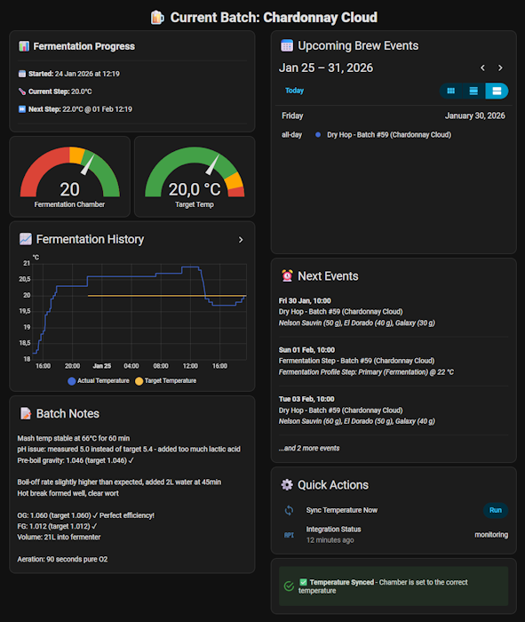
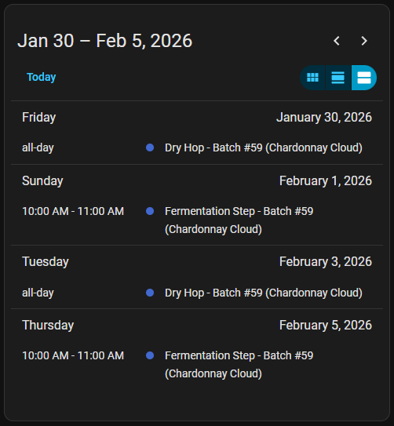

# Brewfather Integration for Home Assistant
### Automate your fermentation like a pro! 🍺  
[](https://www.buymeacoffee.com/mvddonk)  
[](imgs/dashboard.png)

## 🎯 What is this?

**Stop manually adjusting your fermentation chamber temperature!** This integration connects your Brewfather recipes to Home Assistant, automatically controlling your fermentation chamber to follow the exact temperature profile from your recipe.

**Perfect for homebrewers who:**
- ✅ Use Brewfather for recipe management and batch tracking
- ✅ Have a smart fermentation chamber (or want to build one)
- ✅ Want "set and forget" temperature control
- ✅ Don't want to miss temperature changes at 2 AM
- ✅ Want all their brewing data in their smart home dashboard

**Designed for single batch fermentation** - track one batch at a time with full automation support.

---

## ⚡ Key Features

### 🌡️ Automatic Temperature Control
Set your fermentation chamber temperature based on your current Brewfather batch recipe. The integration reads your fermentation schedule and automatically adjusts your climate device to match.

**[Complete Dashboard Example](dashboards/dashboard-complete.yaml)** | **[Automation Example](automations/sync_temperature.yaml)**

### 📅 Event Calendar
Never miss a brewing task! View all upcoming events in a calendar:
- Fermentation temperature changes
- Dry hopping schedules  
- Bottling day reminders
- Custom brew events



### 📊 Fermentation Monitoring
Track your batch progress with real-time sensors:
- Current and upcoming target temperatures
- Fermentation start/end dates
- Days remaining until completion
- Recipe name and batch number

### 🔄 Custom Stream Integration
Send data FROM Home Assistant TO Brewfather:
- Temperature readings from any Home Assistant sensor
- Specific gravity readings from hydrometers (RAPT Pill, Tilt, iSpindel, etc.)
- Real-time fermentation monitoring in Brewfather app

Perfect for brewers with Home Assistant-connected sensors who want to log their fermentation data to Brewfather's cloud.

### 📝 Batch Notes & History
Access your brewing notes and track historical data directly in Home Assistant.

---

## 🚀 Complete Dashboard Example

A ready-to-use dashboard featuring everything you need:

- 🌡️ **Temperature Gauges** - Current vs Target with visual indicators
- 🎛️ **Thermostat Control** - Full climate control for your fermentation chamber
- 📊 **Progress Tracking** - Batch info, start date, fermentation timeline
- 📈 **Historical Graphs** - 7-day history of temperature and gravity
- 📝 **Batch Notes** - Your brewing notes in formatted view
- 📅 **Calendar View** - All events in Home Assistant calendar
- ⏰ **Next Events** - Quick summary of upcoming tasks
- ✅ **Sync Status** - Visual confirmation temperature is correct

**Uses only standard Home Assistant cards - no custom cards required!**

Simply copy [dashboard-complete.yaml](dashboards/dashboard-complete.yaml) and adjust `climate.fermentation_chamber` to your device.

---

## 📱 Available Sensors

All sensors update automatically every 15 minutes:

| Sensor | Description | Entity ID |
|--------|-------------|-----------|
| **Integration Status** | Connection status and health check | `sensor.brewfather_integration_status` |
| **Recipe Name** | Name of your current fermenting beer | `sensor.brewfather_recipe_name` |
| **Fermentation Start** | When fermentation started | `sensor.brewfather_fermentation_start` |
| **Target Temperature** | Current target temp from recipe | `sensor.brewfather_target_temperature` |
| **Upcoming Temperature** | Next temperature step | `sensor.brewfather_upcoming_target_temperature` |
| **Temperature Change Date** | When next temp change occurs | `sensor.brewfather_upcoming_target_temperature_change` |
| **Last Reading** | Latest gravity/temp reading | `sensor.brewfather_last_reading` |
| **Batch Notes** | Your brewing notes | `sensor.brewfather_batch_notes` |
| **Events** | Upcoming brew events (count + details) | `sensor.brewfather_events` |

### 📅 Calendar Entity
`calendar.brewfather_events` - All your brew events in Home Assistant's calendar

Add to dashboard:
```yaml
type: calendar
entities:
  - calendar.brewfather_events
```

---

## 🔧 Detailed Features

### Automatic Temperature Control

The integration continuously monitors your Brewfather batch and provides the target temperature your fermentation chamber should be at. Combine this with the included automation to automatically adjust your climate device.

**How it works:**
1. Integration reads your active Brewfather batch
2. Calculates current target temperature based on fermentation schedule
3. Updates `sensor.brewfather_target_temperature` every 15 minutes
4. Automation compares target to actual and adjusts climate device
5. Your beer ferments perfectly according to recipe!

**Temperature Ramping Support:**
Enable this option to gradually increase/decrease temperature during ramp periods. For example, ramping from 20°C to 24°C over 2 days will increase 1°C every 12 hours instead of jumping immediately.

**Example automation:** [sync_temperature.yaml](automations/sync_temperature.yaml)

### Event Calendar

View all your brewing tasks in Home Assistant's calendar interface. The calendar automatically displays:
- **Fermentation steps** - When temperature changes occur
- **Dry hopping** - When to add hops
- **Bottling day** - When fermentation completes
- **Custom events** - Any events from Brewfather

Events are automatically filtered to show only active, future events. Supports both all-day events (Bottling Day) and timed events (Temperature Change at 14:00).

### Batch Notes

Access your Brewfather batch notes directly in Home Assistant. Perfect for:
- Quick reference during brew day
- Recording observations
- Tracking deviations from recipe
- Sharing notes in dashboards

### Custom Stream - Send Data to Brewfather

Send temperature and gravity readings from Home Assistant sensors to Brewfather for real-time monitoring.

**How it works:**
1. Configure temperature sensor (required) and gravity sensor (optional) in Home Assistant
2. Integration automatically sends readings to Brewfather every 15 minutes
3. Data appears in your Brewfather batch monitoring
4. Monitor fermentation progress from anywhere using Brewfather app

**Setup:**
1. Enable "Custom Stream" in this integration's configuration
2. Get the logging ID from Brewfather app (Batch → Settings → Logging → Custom Stream)
3. Configure your temperature sensor entity (e.g., `sensor.fermentation_temperature`)
4. Optionally configure your gravity sensor entity (e.g., `sensor.rapt_orangeboy_specific_gravity`)
5. Data automatically syncs every 15 minutes

Supports temperature (required) and specific gravity (optional) readings from any Home Assistant sensor, including hydrometers like RAPT Pill, Tilt, iSpindel, and more.

### Experimental: Multiple Batch Support

While designed for single batch operation, experimental multi-batch features are available:
- **Multi-batch mode**: Adds `other_batches` attributes to sensors
- **All batches data sensor**: Complete API data for all fermenting batches

*Note: These features are experimental and may change in future versions.*

---

## ⚙️ Configuration Options

Configure via Home Assistant UI (Settings → Integrations → Brewfather → Configure):

### Temperature Ramping
Enable gradual temperature increases/decreases during fermentation ramp periods. Useful for precise temperature control during multi-step fermentations.

### Custom Stream
Send temperature and gravity data from Home Assistant sensors to Brewfather. Requires:
- Temperature sensor entity (required)
- Specific gravity sensor entity (optional, for hydrometers)
- Brewfather Custom Stream logging ID
- Automatic unit conversion and validation

Perfect for integrating external sensors like RAPT Pill, Tilt, iSpindel, or any Home Assistant-connected temperature/gravity sensors with Brewfather's cloud logging.

### Multiple Batch Support (Experimental)
Track multiple fermenting batches with additional sensor attributes. Not recommended for automation purposes.

### All Batches Data Sensor (Experimental)
Creates sensor with complete API data for all batches. Useful for custom dashboards and templates.

---

## 📥 Installation

### HACS Installation (Recommended)

1. Make sure [HACS](https://hacs.xyz/) is installed
2. Go to HACS → Integrations
3. Search for "Brewfather"
4. Click "Download"
5. Restart Home Assistant
6. Go to Settings → Integrations → Add Integration
7. Search for "Brewfather"  
Or click here: <a href="https://my.home-assistant.io/redirect/integration/?domain=brewfather">Add Brewfather Integration</a>  
[](imgs/integration_install-via-link.png)


### Manual Installation

1. Copy `custom_components/brewfather` folder to your Home Assistant's `custom_components` directory
2. Restart Home Assistant
3. Go to Settings → Integrations → Add Integration → Brewfather

---

## 🧙‍♂️ Setup Wizard

### Step 1: Connection Details

Enter your Brewfather credentials:

- **Connection name**: Friendly name for this connection (e.g., "My Brewery")
- **User ID**: Your Brewfather User ID (found in Settings → API)
- **API Key**: Generate from Brewfather Settings → API → Generate API Key

**Required API Scope:** `batches:read`

[](imgs/integration_setup.png)

### Step 2: Choose Features

Select which features to enable:
- ☑️ **Temperature ramping** - Gradual temp changes during ramps
- ☑️ **Custom stream** - Receive data from Brewfather devices  
- ☐ **Multiple batch support** - Experimental multi-batch tracking
- ☐ **All batches data sensor** - Complete API data sensor

### Step 3: Custom Stream Setup (if enabled)

Configure Brewfather-to-Home Assistant streaming:
- **Logging ID or Stream URL**: From Brewfather Custom Stream settings
- Integration receives data from devices connected to Brewfather (iSpindel, Tilt, etc.)

The integration validates your configuration and tests the connection.

[](imgs/integration_success.png)

---

## 🌍 Multi-Language Support

Full translation support for:
- 🇺🇸 English (Default)
- 🇫🇷 Français (French)
- 🇪🇸 Español (Spanish)
- 🇳🇱 Nederlands (Dutch)
- 🇩🇪 Deutsch (German)
- 🇮🇹 Italiano (Italian)
- 🇵🇹 Português (Portuguese)
- 🇧🇷 Português Brasileiro (Brazilian Portuguese)

The interface automatically uses your Home Assistant language setting.

---

## 📚 Creating Brewfather API Key

1. Open Brewfather app or web interface
2. Go to **Settings** → **API**
3. Click **Generate API Key**
4. Give it a name (e.g., "Home Assistant")
5. Select scope: **Read Batches** (minimum required)
6. Copy the generated User ID and API Key

[Official Brewfather API Documentation](https://docs.brewfather.app/api)

---

## ⬆️ Upgrading from v1 to v2

**Important: Breaking changes!** All sensors have been renamed.

### What Changed:
- Sensor entity IDs now use `brewfather_` prefix
- Integration status sensor added
- Improved error handling and validation
- Multi-language support

### Migration Steps:
1. **Before upgrading:** Note which automations/dashboards use Brewfather sensors
2. **Upgrade** via HACS
3. **Update entity IDs** in your automations and dashboards:
   - Old: `sensor.recipe_name` → New: `sensor.brewfather_recipe_name`
   - Old: `sensor.target_temperature` → New: `sensor.brewfather_target_temperature`
4. **Test** your automations

[Full v1 to v2 Migration Guide](docs/v1-to-v2.md)

---

## 🤝 Support

Found a bug? Have a feature request?

- **Issues**: [GitHub Issues](https://github.com/MvdDonk/Brewfather/issues)

Enjoying this integration? <a href="https://www.buymeacoffee.com/mvddonk">Buy me a beer! 🍺</a>

---

**Happy Brewing! 🍻**
