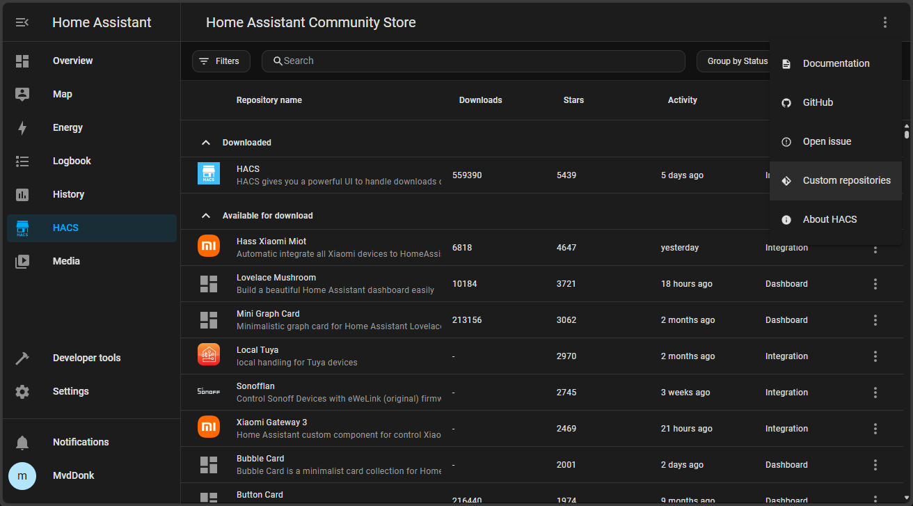
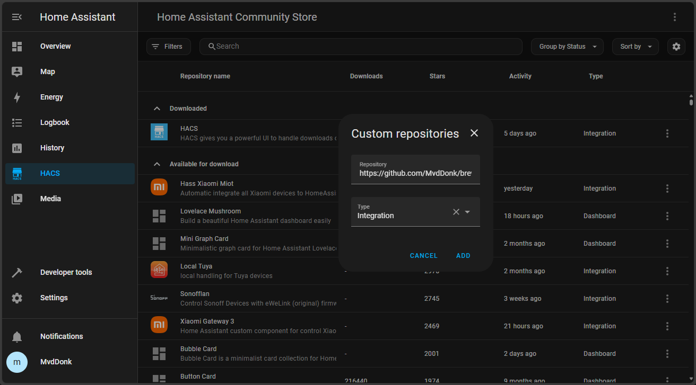
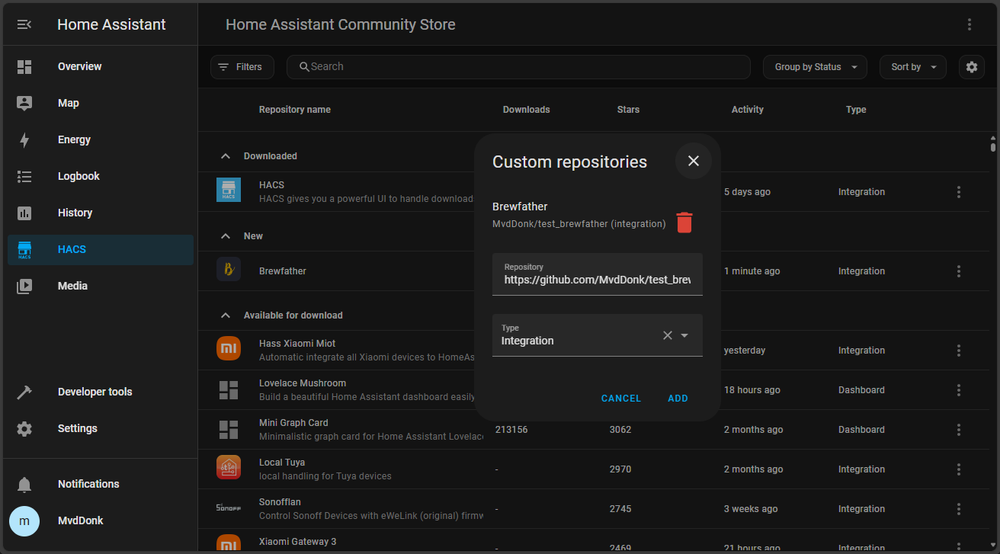
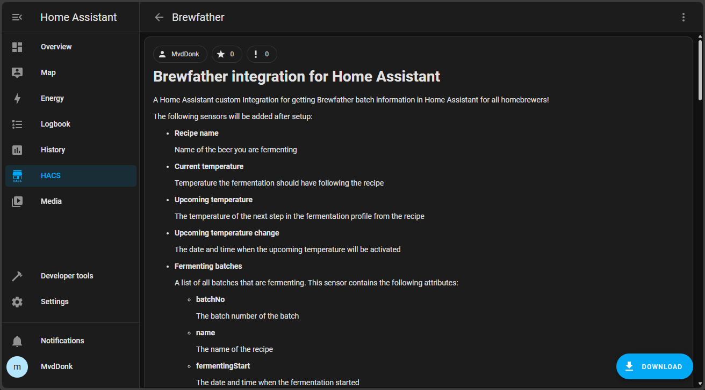
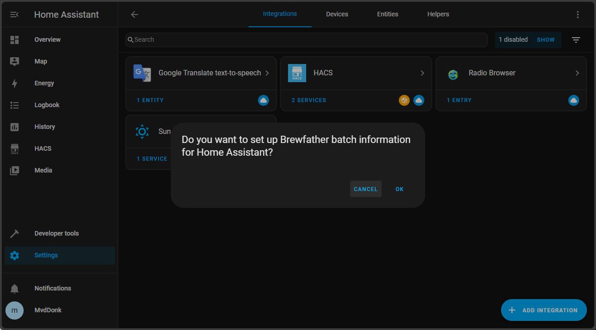
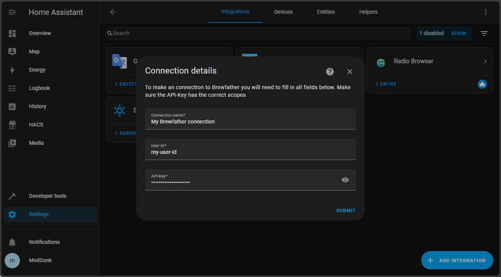
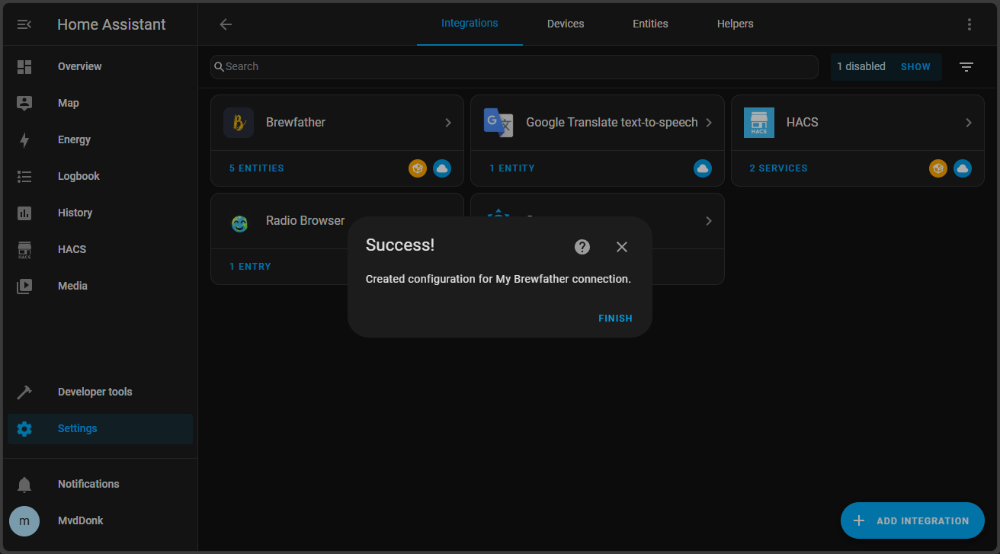
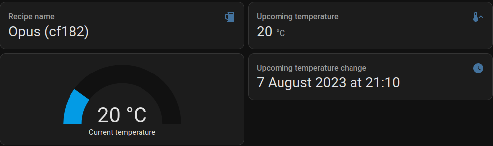
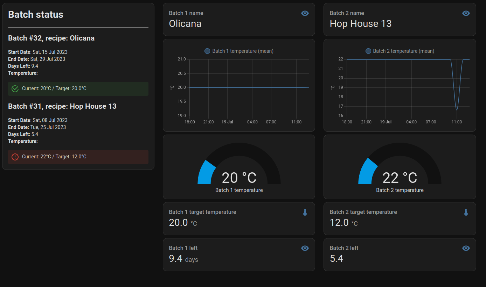

# Brewfather integration for Home Assistant
A Home Assistant custom Integration for getting Brewfather batch information in Home Assistant for all homebrewers!

The following sensors will be added after setup:
- **Recipe name**

  Name of the beer you are fermenting
- **Current temperature**

  Temperature the fermentation should have following the recipe
- **Upcoming temperature**

  The temperature of the next step in the fermentation profile from the recipe
- **Upcoming temperature change**

  The date and time when the upcoming temperature will be activated
- **Fermenting batches**

    A list of all batches that are fermenting. This sensor contains the following attributes:
    - **batchNo**
    
        The batch number of the batch
    - **name**
    
        The name of the recipe
    - **fermentingStart**
    
        The date and time when the fermentation started
    - **fermentingEnd**
    
        The date and time when the fermentation should be finished
    - **fermentingLeft**
    
        The number of days left until the fermentation is finished
    - **target_temperature**
    
        The temperature the fermentation should have following the recipe
    - **current_temperature**
    
        The current temperature of the fermentation based on readings entered into the app or through a connected device


# Installation
Installing using [HACS](https://hacs.xyz/) is <u>recommended</u>. It is the easiest way to install and keep your integration up to date.

## Manual installation (not recommended)
Copy the `custom_components/brewfather` folder and all of its contents into your Home Assistant's custom_components folder. This folder is usually inside your `/config` folder. If you are running Hass.io, use SAMBA to copy the folder over. If you are running Home Assistant Supervised, the custom_components folder might be located at `/usr/share/hassio/homeassistant`. You may need to create the `custom_components` folder and then copy the brewfather folder and all of its contents into it.

## HACS installation (easy and supports automated updates)
1. First make sure you have [HACS](https://hacs.xyz/) installed and running.
1. Go to the HACS dashboard, click the menu (three dots) in the top right and select "Custom repositories"  
<a href="docs/images/hacs_custom-repo.png"></a>
1. In the field "Repository" add the following value: https://github.com/MvdDonk/brewfather  
   For "Type" choose "Integration"  
<a href="docs/images/hacs_custom-repo-popup.png"></a>
1. After clicking "ADD" you should see the repository added and a red trash can  
<a href="docs/images/hacs_repo-added.png"></a>
1. In the HACS dashboard search for Brewfather or click on this <a href="https://my.home-assistant.io/redirect/hacs_repository/?owner=MvdDonk&repository=Brewfather">link</link> and click on the "DOWNLOAD" button  
<a href="docs/images/hacs_download-addon.png"></a>
1. After downloading you might have to restart Home Assistant (HACS will tell you if so). After Home Assistant has restarted install the Brewfather integration by clicking <a href="https://my.home-assistant.io/redirect/integration/?domain=brewfather">here</a> or go to integrations ans search for Brewfather  
<a href="docs/images/integration_install-via-link.png"></a>
1. A dialog will popup containing the following fields:  
**Connection name**  
  A unique name for your Brewfather connection that will be used in Home Assistant  
  **User ID**  
  User ID used for API-access. You can get this in the Brewfather app under Settings -> Api -> Generate API-Key.  
  **API-Key**  
  API-Key with the correct scopes. This is also located in Settings -> Api -> Generate API-Key. For more info on how to create a correct key see the section "Creating a Brewfather API-key" below.   
<a href="docs/images/integration_setup.png"></a>  
1. The integration will test your connection and if everything succeeded you will see the following popup. Brewfather is now connected to your Home Assistant instance!  
<a href="docs/images/integration_success.png"></a>

## Creating a Brewfather API-Key  
To create a Brewfather API-key follow the documentation on [Brewfather - docs](https://docs.brewfather.app/api#generate-api-key). Make sure to give the API-key at least the "Read Batches" [scope](https://docs.brewfather.app/api#scopes).


## Single Batch Support

The integration produces a sensor for recipe name, current temperature, upcoming temperature and upcoming temperature change date for the most recently started batch. This can be displayed in home assistant by creating a new dashboard and copying the contents of the `dashboard/dashboard-single-batch.png` file into it.



## Multiple Batch Support

Multiple batch support is available through the use of custom templates and a custom dashboard. All the data for all currently fermenting batches is stored in the `fermenting_batches` sensor. The `fermenting_batches` sensor as a `data` attribute that contains a list of all fermenting batches. The `data` attribute is a list of dictionaries. You can follow the below steps to add the custom templates and dashboard to display all fermenting batch information in your Home Assistant.

Copy the `custom_templates` folder and all of its contents into your Home Assistant's custom_templates folder, this should be in the config directory next to custom_components. If the custom_templates folder does not exist, create it.

Copy the contents of the `template_sensors/template_sensors.yaml` file and paste it on to the end of the `config/configuration.yaml` file. If you already have a `template` and `sensor` section, just copy the contents of the `template_sensors.yaml` file excluding the first 2 lines and paste it into your existing `template` / `sensor` section.

A `dashboard/dashboard-multi-batch.png` file has been included in this repository. To use it, create a new dashboard amd copy the contents of the `dashboard-multi-batch.png` file into it. The dashboard shows up to 4 batches, if you have more than 4 batches you will need to add more cards to the dashboard and template_sensors.yaml.

### Dashboard



# Setup

After installation is completed you must create a new integration in Home Assistant by clicking on the "ADD INTEGRATION" button and search for "Brewfather". A dialog will popup containing the following fields:
- **Connection name**

  A unique name for your Brewfather connection that will be used in Home Assistant
- **User ID**

  User ID used for API-access. You can get this in the Brewfather app under Settings -> Api -> Generate API-Key.
- **API-Key**

  API-Key with the correct scopes. This is also located in Settings -> Api -> Generate API-Key. For more info on how to create a correct key see the section "Creating a Brewfather API-key" below.

## Creating a Brewfather API-Key

To create a Brewfather API-key follow the documentation on [Brewfather - docs](https://docs.brewfather.app/api#generate-api-key). Make sure to give the API-key at least the "Read Batches" [scope](https://docs.brewfather.app/api#scopes).

## Getting batch information

Setup a markdown card with the following content to get the batch information in Home Assistant:

```
type: markdown
content: |-
  # Batch status
  ---
  
    ## Batch \#{{ batch.batchNo }}, recipe: {{ batch.name }}
    **Start Date**: {{ batch.fermentingStart.strftime('%a, %d %b %Y') }}
    **End Date:** {{ batch.fermentingEnd.strftime('%a, %d %b %Y') }}
    **Days Left:** {{ batch.fermentingLeft | round(1) }}
    **Temperature:** 
    
    <ha-alert alert-type="success">
    
    <ha-alert alert-type="error">
    Current: {{ batch.current_temperature }}°C / Target: {{ batch.target_temperature }}°C
    <ha-alert alert-type="warning">Unknown / Target: {{ batch.target_temperature }}°C
    </ha-alert>

  


```

# Developing

Partial support for testing API response parsing is available in [test_connection.py](custom_components%2Fbrewfather%2Ftest_connection.py). You will need your User ID and API Key to run the tests. These should be set as the environment variables `USER_ID` and `API_KEY`

The following commands can be used to run the tests:
```shell
export USER_ID=your_user_id
export API_KEY=your_api_key
pytest
```


| V1 Name                     | V1 alias                           | V2 Name                                             | V2 alias                                                   |   |
|-----------------------------|------------------------------------|-----------------------------------------------------|------------------------------------------------------------|---|
| Upcoming temperature        | sensor.upcoming_temperature        | Brewfather Batch upcoming target temperature        | sensor.brewfather_batch_upcoming_target_temperature        |   |
| Upcoming temperature change | sensor.upcoming_temperature_change | Brewfather Batch upcoming target temperature change | sensor.brewfather_batch_upcoming_target_temperature_change |   |
| Recipe name                 | sensor.recipe_name                 | Brewfather Batch recipe name                        | sensor.brewfather_batch_recipe_name                        |   |


New sensor
shows current batch sg points, latest  reading

brewfather_batch_last_reading
state: 1.029

state_class: measurement
icon: mdi:chart-line
friendly_name: Brewfather Batch last reading
batch_id: FWEf1kryZXbaovkHOaaDqyROqoy19S
angle: null
temp: 21
time_ms: 1731236447317
time: "2024-11-10T11:00:47.317000+00:00"


optional sensor:
all batches info, same attribute data as v1