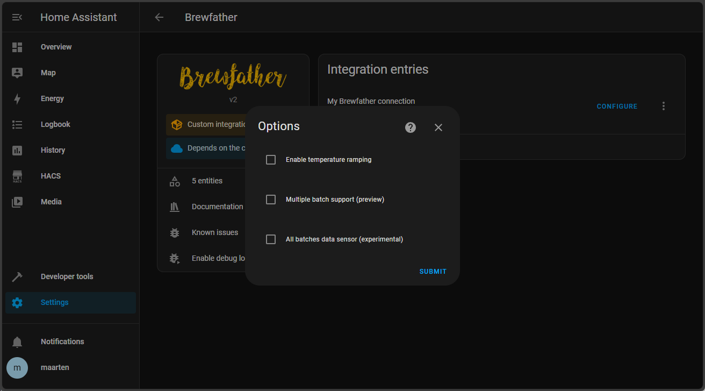
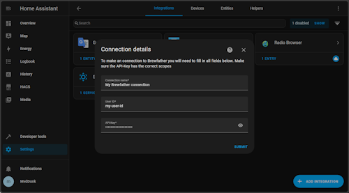
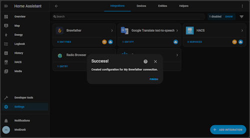

# Brewfather integration for Home Assistant
### A Home Assistant custom Integration for getting Brewfather batch information in Home Assistant for all homebrewers!  
<a href="https://www.buymeacoffee.com/mvddonk"></a>    


# Single Batch Support  
The integration produces a sensor for recipe name, current temperature, upcoming temperature and upcoming temperature change date for the most recently started batch. This can be displayed in Home Assistant by creating a new dashboard and copying the contents of the `dashboard/dashboard.yaml` file into it.


# Multiple Batch Support  
You can track multiple batches by either using the [Multiple batch support (preview)](#multi-batches) option, see below or  by using custom template and sensors:


## Alternative using all Brewfather API data sensor
*In order to use the Brewfather API data the option [All batches data sensor (experimental)](#all-batches-data) must be enabled.*  

Multiple batch support is available through the use of custom templates and a custom dashboard. All the data for all currently fermenting batches is stored in the `fermenting_batches` sensor. The `fermenting_batches` sensor as a `data` attribute that contains a list of all fermenting batches. The `data` attribute is a list of dictionaries. You can follow the below steps to add the custom templates and dashboard to display all fermenting batch information in your Home Assistant.

Copy the `custom_templates` contents into your Home Assistant's custom_templates folder, this should be in the config directory next to custom_components. If the custom_templates folder does not exist, create it.

Copy the contents of the `template_sensors/template_sensors.yaml` file and paste it on to the end of the `config/configuration.yaml` file. If you already have a `template` and `sensor` section, just copy the contents of the `template_sensors.yaml` file excluding the first 2 lines and paste it into your existing `template` / `sensor` section.

A `dashboard/dashboard-multi-batch.png` file has been included in this repository. To use it, create a new dashboard amd copy the contents of the `dashboard-multi-batch.png` file into it. The dashboard shows up to 4 batches, if you have more than 4 batches you will need to add more cards to the dashboard and template_sensors.yaml.


### Getting batch information  
Setup a markdown card with the following content to get the batch information in Home Assistant:

```
type: markdown
content: |-
  # Batch status
  ---
  
    ## Batch \#{{ batch.batchNo }}, recipe: {{ batch.name }}
    **Start Date**: {{ batch.fermentingStart.strftime('%a, %d %b %Y') }}
    **End Date:** {{ batch.fermentingEnd.strftime('%a, %d %b %Y') }}
    **Days Left:** {{ batch.fermentingLeft | round(1) }}
    **Temperature:** 
    
    <ha-alert alert-type="success">
    
    <ha-alert alert-type="error">
    Current: {{ batch.current_temperature }}°C / Target: {{ batch.target_temperature }}°C
    <ha-alert alert-type="warning">Unknown / Target: {{ batch.target_temperature }}°C
    </ha-alert>

  
```

# Sensors list
The following sensors will be added after setup:
- **Recipe name**  
  Name of the beer you are fermenting.  
  `sensor.brewfather_recipe_name`  
- **Fermentation start date**  
  Date and time when the fermentation has started  
  `sensor.brewfather_fermentation_start`  
- **Current temperature**  
  Temperature the fermentation should have following the recipe  
  `sensor.brewfather_target_temperature`  
- **Upcoming temperature**  
  The temperature of the next step in the fermentation profile from the recipe  
  `sensor.brewfather_upcoming_target_temperature`  
- **Upcoming temperature change**  
  The date and time when the upcoming temperature will be activated  
  `sensor.brewfather_upcoming_target_temperature_change`  
- **Latest reading**  
  Latest reading (if available in Brewfather) in points sg. The history of this sensor will be kept in Home Assistant allowing you to render a graph.
  `sensor.brewfather_last_reading`  
- **Fermenting batches**  
    *To use this sensor you have to enable "All batches data sensor (experimental)", see below*  
    A list of all batches that are fermenting. This sensor contains the following attributes:      
    `sensor.brewfather_all_batches_data`  
    - **batchNo**      
        The batch number of the batch
    - **name**      
        The name of the recipe
    - **fermentingStart**      
        The date and time when the fermentation started
    - **fermentingEnd**      
        The date and time when the fermentation should be finished
    - **fermentingLeft**      
        The number of days left until the fermentation is finished
    - **target_temperature**      
        The temperature the fermentation should have following the recipe
    - **current_temperature**      
        The current temperature of the fermentation based on readings entered into the app or through a connected device

# Options
## Enable temperature ramping
When enabled and used with temperature ramping in Brewfather the target temperature will slowly increase towards the next temperature during the ramping period. For example: current fermenting step temperature is 20c and the next step is 24°C with a ramp of 2 days it will increase the temperature 1c every (2 * 24) / (24-20) = 12 hours. This will result in the following temperature schedule:
| Date | Target temp | Hours into ramp | Step status |
|--------|--------|--------|--------|
| 11/02/2024 13:00 | 20°C | 0 |  |
| 11/03/2024 01:00 | 21°C | 12| Ramping |
| 11/03/2024 13:00 | 22°C | 24| Ramping |
| 11/04/2024 01:00 | 23°C | 36| Ramping |
| 11/04/2024 13:00 | 24°C | 0 | Ramping stopped, target temperature set |

## <a name="multi-batches"></a>Multiple batch support (preview)
This is a work in progress (that's why it's in preview) but it's the first easy out of the box multi batch support. Each sensor will get an additional attribute "other_batches" which will contain the same category data as the sensor but for all other active batches. For example `brewfather_recipe_name` will have the following extra attribute data:
```
other_batches:
  - batch_id: sVFLpIADPYj612oIwnTaNX2sFgUtna
    state: Hoppy weizen
```

## <a name="all-batches-data"></a>All batches data sensor (experimental)
Enabling this will give you a extra sensor `brewfather_all_batches_data` containing all the Brewfather API data just like in v1. Take a look at the custom templates of Multiple Batch Support how to use this data. This setting is experimental because it might be dropped in the future if better multi batch support is implemented.  
You can only enable this option by going to the Brewfather integration and clicking configure.   
<a href="docs/images/v2/configure_options-popup.png"></a>  
*In v1 this used to be enabled by default but to limit the amount of data it is now configurable and disabled by default.*  

# Installation
Installing using [HACS](https://hacs.xyz/) is <u>recommended</u>. It is the easiest way to install and keep your integration up to date.

## HACS installation (easy and supports automated updates)
1. First make sure you have [HACS](https://hacs.xyz/) installed and running.
1. Go to the HACS dashboard, search for "Brewfather" and click "DOWNLOAD"
1. After downloading you might have to restart Home Assistant (HACS will tell you if so). After Home Assistant has restarted install the Brewfather integration by clicking <a href="https://my.home-assistant.io/redirect/integration/?domain=brewfather">here</a> or go to integrations ans search for Brewfather  
[](integration_install-via-link.png)
1. A dialog will popup containing the following fields:  
**Connection name**  
  A unique name for your Brewfather connection that will be used in Home Assistant  
  **User ID**  
  User ID used for API-access. You can get this in the Brewfather app under Settings -> Api -> Generate API-Key.  
  **API-Key**  
  API-Key with the correct scopes. This is also located in Settings -> Api -> Generate API-Key. For more info on how to create a correct key see the section "Creating a Brewfather API-key" below.   
[](integration_setup.png)
1. The integration will test your connection and if everything succeeded you will see the following popup. Brewfather is now connected to your Home Assistant instance!  
[](integration_success.png")

## Manual installation (not recommended)
Copy the `custom_components/brewfather` folder and all of its contents into your Home Assistant's custom_components folder. This folder is usually inside your `/config` folder. If you are running Hass.io, use SAMBA to copy the folder over. If you are running Home Assistant Supervised, the custom_components folder might be located at `/usr/share/hassio/homeassistant`. You may need to create the `custom_components` folder and then copy the brewfather folder and all of its contents into it.

## Creating a Brewfather API-Key  
To create a Brewfather API-key follow the documentation on [Brewfather - docs](https://docs.brewfather.app/api#generate-api-key). Make sure to give the API-key at least the "Read Batches" [scope](https://docs.brewfather.app/api#scopes).

# Upgrading from v1 to v2 - breaking changes!
All sensors are renamed so there are some breaking changes. Please take a look at the [upgrade docs](docs/v1-to-v2.md).
