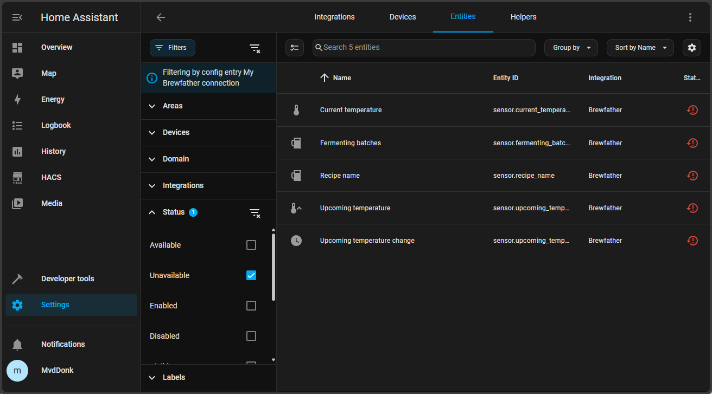
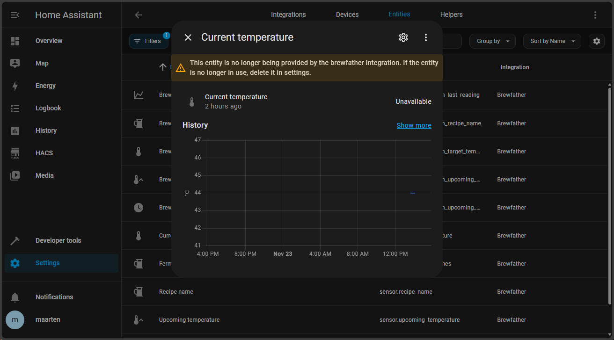
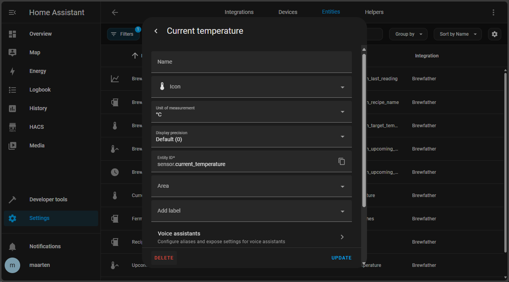
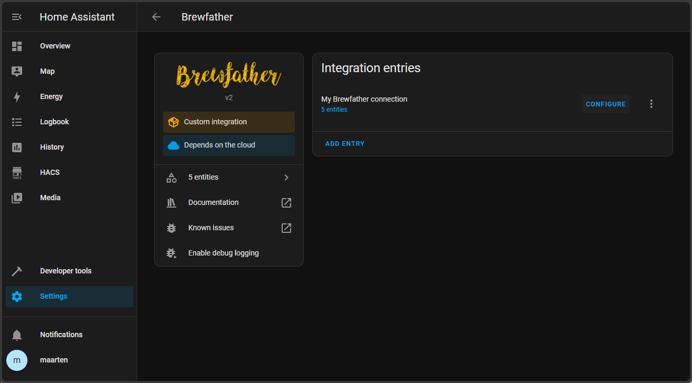

# Updating from v1 to v2
The addon has been rebuilt from the ground up and I had to rename the sensors which breaks backwards compatibility. Therefor some manual steps are required after updating to v2.

## Sensor renames

| V1 Sensor name              | V1 Sensor alias                    | V2 Sensor name                                      | V2 Sensor alias                                            |
|-----------------------------|------------------------------------|-----------------------------------------------------|------------------------------------------------------------|
| Upcoming temperature        | sensor.upcoming_temperature        | Brewfather batch upcoming target temperature        | sensor.brewfather_batch_upcoming_target_temperature        |
| Upcoming temperature change | sensor.upcoming_temperature_change | Brewfather batch upcoming target temperature change | sensor.brewfather_batch_upcoming_target_temperature_change |
| Recipe name                 | sensor.recipe_name                 | Brewfather batch recipe name                        | sensor.brewfather_batch_recipe_name                        |
| Current temperature         | sensor.current_temperature         | Brewfather batch target temperature                 | sensor.brewfather_batch_target_temperature                 |
| Fermenting batches          | sensor.fermenting_batches          | Brewfather all batches data *                       | sensor.brewfather_all_batches_data                         |

\* *Only available after manually enabling in options, see [info](#all-batches-data)*

### Removing old sensors
Because of the sensor renames you have to manually remove the old (v1) sensors that are still in your Home Assistant. Go to the <a href="https://my.home-assistant.io/redirect/integration/?domain=brewfather">integration</a> and entities. There you will see some sensors with a red explanation mark.  
  

Remove those sensors one by one by clicking on them and clicking on the cog in the popup:  

From here you can click the "Delete" button at the bottom left:  

# Options
Starting in v2  you can now configure options after setting up the Brewfather integration. Go to the <a href="https://my.home-assistant.io/redirect/integration/?domain=brewfather">integration</a> and click "Configure":  

## Brewfather all batches data (in v1 known as "Fermenting batches")
If you want to have all the Brewfather API data in Home Assistant you can enable "All batches data sensor" in the configure menu. 
The data remained the same as in V1 but the name and alias has change, see table above. This sensor has been made optional because of the amount of data it uses and 
if you are only fermenting a single batch at the same time you will not need this.

### Experimental
The usage of "All batches data sensor" is marked experimental because it might be removed or changed in the future (if I have found a better way to support multiple batches).  

